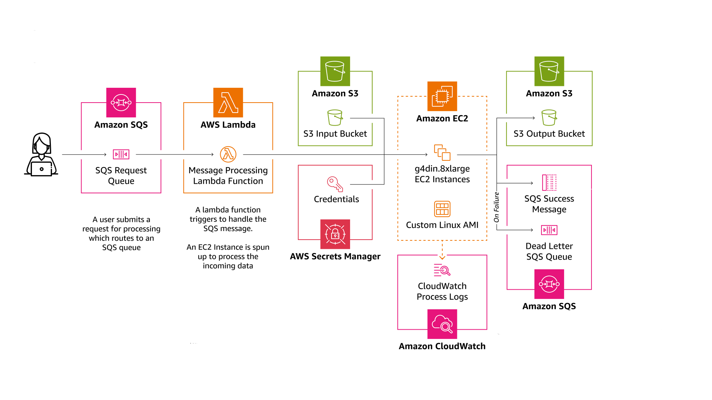

# Project Aurora - Containerized Houdini on AWS
Project Aurora allows you to easily set up a containerized Houdini environment on AWS. This project is a collaboration between [SideFX Software](https://www.sidefx.com/), [AWS](https://aws.amazon.com/) and [Bismuth Consultancy](http://bismuth.at/). It is provided as is, without any warranty or liability from the parties aforementioned.

This repo is meant to be used as a sample by Pipeline TDs to learn about the possibilities of cloud compute for Houdini. The README explains how to use all the different functionality provided, but is by no means meant to be a tutorial educating you about Houdini/AWS/Docker.



## Getting Started

> [!WARNING]
> This sample will provide the tooling to provision and run AWS infrastructure to get started with Cloud Compute with Houdini. Running any kind of compute / sample provided below will incur costs on your AWS account! <b>Make sure you understand what you are running before running it!</b>

### Prerequisites
- You have a valid AWS Account with the required permissions.
    - In this sample we are using `eu-north-1` as the AWS region in links and default arguments. <i>You can use any other region you want, but be sure to change the relevant settings accordingly.</i>
    - Ensure you also have sufficient `On-Demand G and VT instances` service quota. They can be requested [here](https://eu-north-1.console.aws.amazon.com/servicequotas/home/services/ec2/quotas/L-DB2E81BA). For the `g4dn.2xlarge` we are using in this sample you need at least a capacity of 8 vCPU. You can also modify this sample to not use any GPU capable instances, but since this sample at some point will also include use of Unreal Engine it has been decided to support GPU instances from the start.
- You have a valid SideFX Account with the required licenses.
    - At least 1 Houdini Engine license is required. (The Unreal/Unity specific licenses do not work!)

### First time setup
1. Clone this repository to disk.
2. Define the `AURORA_TOOLING_ROOT` environment variable on your machine. It should be set to the root folder this cloned repository.
3. Set up a local python environment compatible with this repo's codebase.<br>
    <i>The easiest is to use [Miniconda](https://www.anaconda.com/docs/getting-started/miniconda/install) to set it up automatically using the environment.yml provided in the repo:</i>
    ```bash
    # To create the env:
    conda env create -f environment.yml

    # To remove the env:
    conda remove -n aurora_env --all
    ```
4. Install [Docker](https://www.docker.com/get-started/).
    - Docker is used to locally build a containerized deployment of Houdini.
5. Install [Terraform](https://developer.hashicorp.com/terraform/install).
    - Terraform is used to automatically provision the AWS Infrastructure.
6. Install [Packer](https://developer.hashicorp.com/packer/tutorials/aws-get-started/get-started-install-cli).
    - Packer is used to automatically build the AMI (Amazon Machine Image).
7. Install [AWS CLI](https://docs.aws.amazon.com/cli/latest/userguide/getting-started-install.html).
    - AWS CLI is used to communicate with AWS through commandline. It also securely manages your AWS credentials.
8. Set up your local AWS CLI credentials using `aws configure`.
    - For "default region name" we use `eu-north-1` in this sample.
    - [Information on credentials](https://docs.aws.amazon.com/IAM/latest/UserGuide/security-creds-programmatic-access.html).
9. Create [AWS Secrets](https://aws.amazon.com/secrets-manager/) in the same region as what you used in the `aws configure` command for SideFX API Access Tokens, and Github Credentials:
    - `GithubCredentials` containing `PAT` entry with a [Github PAT](https://docs.github.com/en/authentication/keeping-your-account-and-data-secure/managing-your-personal-access-tokens) for your Github repo containing your tooling.
    - `SideFXOAuthCredentials` containing `sidefx_client`, `sidefx_secret` [SideFX API Credentials](https://www.sidefx.com/docs/api/credentials/index.html).
10. Create a [EC2 Key Pair](https://docs.aws.amazon.com/AWSEC2/latest/UserGuide/create-key-pairs.html) and securily store it locally. 
    - It should be `.pem` format. In this project it is named `aurora-key-pair.pem`.
    - Ensure the key has [the right permissions](https://repost.aws/questions/QUsZqMJGVtQmemkEMVwxUiIw/why-should-i-change-the-permissions-on-the-ssh-pem-file) on your PC, or it will result in an error. 


## Practical Examples
> [!WARNING]
> In the examples below the used filepaths are just examples. Please adjust them where necessary!

### Testing & Developing Locally
To test the docker setup locally; For example to debug or develop easily you can run the main commands in the already setup conda environment.

> [!IMPORTANT]
> All commands shown below are run from within the `$AURORA_TOOLING_ROOT` root folder, and assume you are in the conda environment configured earlier.
> You can enter it as follows after setting it up:
> ```bash
> conda activate aurora_env
> ```

> [!WARNING]
> You will want to modify the IP address in [provision_cloud.tf](infra\provisioning\deployment\provision_cloud.tf) from `0.0.0.0` to your own IP. This improves security and allows you to SSH into the EC2 instances.


#### 1. Building Docker Image
<details>
<summary>Instructions</summary>

To build the docker image, follow the below steps.

1. Enter conda env created earlier.
2. Run the the following command from the repository root, which will build the docker image for local testing:
```bash
python infra/build_util.py --build_images
```
</details>

> [!TIP]
>  After the above command completes successfully, you can confirm it exists by running `docker images`. It should list an image named `houdini_aws`.

#### 2. Running Docker Image Locally
<details>
<summary>Instructions</summary>

To test the provided sample (or your own data!) you can do the following:
1. Extract the `$AURORA_TOOLING_ROOT/samples/JobPackageSample.zip` into `$AURORA_TOOLING_ROOT/SHARED/`. 
2. Enter conda env created earlier.
3. Run the already built image with the following command:
```bash
python runtime/run.py --process_hip --work_directive "$DATA_ROOT/houdini_directive.json"
```
</details>

### Defining a JobPackage
In order for Houdini and the Aurora sample to know what and how to process a `.hip` file, you need to create what is called a `work_directive.json` as part of a job package. A sample of such a work directive (and job package) can be found inside `$AURORA_TOOLING_ROOT/JobPackageSample.zip`. In this section we will look at how you can create your own.

> [!IMPORTANT]
> All filepaths used in the `work_directive.json` should alway be relative paths. Paths used for files within the JobPackage zip should always use `$DATA_ROOT` to specify the root of the package.

<details>
<summary>Instructions</summary>

In order to have a JobPackage.zip be valid, you need at least 2 things:
1. `work_directive.json`
    - This will contain all the "instructions" that Houdini needs to correctly process your file.
2. Houdini file (`.hip`)
    - This is the houdini file used for processing. You are able to include multiple `.hip` files.

#### Understanding the work_directive.json
The work directive is a simple JSON, which contains a list with processing entries. As you can see, the JSON root element is a list (seen by the `[ ]`). This list contains dictionary entries which have all the relevant configs used by the [houdini processor](runtime/houdini/processing.py). The processor will process the entries based on the index they have in this list; This can be used to for example cook certain hip files before others. The most important elements are as follows:
- `enabled` - Boolean indicating if this entry should be considered for processing.
- `hip_file` - This is the filepath to the `.hip` that should be processed. `$DATA_ROOT` should always be used to indicate the root of the `.zip` file.
- `hip_file_debug` - (optional) This is an optional filepath you can specify (also relative to `$DATA_ROOT`), where a copy of the input `.hip` will be saved with all of its parameters set based on the `work_directive.json`. This is primarily useful for debugging. This field is <i>optional</i>.
- `inputs` - This is a list (also indicated by `[ ]`), containing all of the parameters that need to be set in the `.hip` file. 
    - `node` - The full absolute path to the node that needs to be configured.
    - `parm` - The parameter name that needs to be configured on the relevant node.
    - `value` - The value that needs to be set on the relevant parameter.
    - `type` - The type of value that is being set. This is mainly to detect invalid configurations and help debug potential issues.
        - `literal` - A literal value you want to set.
        - `input_file` - Specified that the value which is set is an input file. This will run a check to make sure the specified input file is actually present / available.
        - `required` (optional) - Field indicating whether or not this input file is required for the cook to succeed. This is useful when you wish to reuse the same `work_directive.json` with multiple input datasets.
- `execute` - This is a list (also indicated by `[ ]`), pointing to buttons that should be pressed to run the cook of the `.hip` file. For example the "Save to Disk" button on a Geometry ROP. You can add as many as you want. Notice that the path is pointing to the actual button parameter itself. (`<node_path>/<parameter_name>`)
```json
[
  {
    "enabled": true,
    "hip_file": "$DATA_ROOT/SampleFile.hip",
    "hip_file_debug": "$DATA_ROOT/OUT/debug/SampleFile.hip",
    "inputs": [
      {
        "node": "/obj/geo1/color1",
        "parm": "colorr",
        "value": 1.0,
        "type": "literal"
      },
      {
        "node": "/obj/geo1/IN_FILE",
        "parm": "file",
        "value": "$DATA_ROOT/IN/rubber_toy.bgeo.sc",
        "type": "input_file",
        "required": true
      },
      {
        "node": "/obj/geo1/EXPORTER",
        "parm": "sopoutput",
        "value": "$DATA_ROOT/OUT/exported_geometry.bgeo.sc",
        "type": "output_file"
      }
    ],
    "execute": [
      "/obj/geo1/EXPORTER/execute"
    ]
  }
]
```

#### Understanding the .hip
It is recommended to either embed all (non-standard) asset definitions into the `.hip`, or ensure you also add the relevant `.hda` files in either the JobPackage or in the tooling of the cloned repo during processing. For the latter two approaches you may need to extend the functionality of this sample to automatically load the relevant asset definitions.


</details>

### AWS Infrastructure

#### 1. Building the AMI (Amazon Machine Image)
<details>
<summary>Instructions</summary>

To build the AMI,  run the following from the repository root:
```bash
python infra/build_util.py --build_ami --keypair $AURORA_TOOLING_ROOT/infra/provisioning/aurora-key-pair.pem
```
This will start building an AMI which can later be used to run the containerized Houdini on AWS!
</details>

#### 2. Provisioning AWS Infrastructure
<details>
<summary>Instructions</summary>

To provision the AWS Infrastructure, you can run the following command:
```bash
python infra/build_util.py --provision_aws
```
This provision the AWS Infrastructure, which will be used to run all the cloud compute with Houdini.
</details>

#### 3. Uploading Job Package to S3 Input Bucket
Before you can process a Job Package, you need to upload it to the S3 Aurora Input Bucket.

<details>
<summary>Instructions</summary>

To upload a file to the S3 Aurora Input bucket, you can either do this manually through the AWS Console, or with the AWS CLI.
In this sample we will be using the JobPackage found in `$AURORA_TOOLING_ROOT/samples/JobPackageSample.zip`.


To upload the sample file to S3 input bucket, use the following command:
```bash
aws s3 cp samples/JobPackageSample.zip s3://aurora-input-bucket/JobPackageSample.zip
```

If instead you want to upload it manually, visit the [S3 general purpose buckets](https://eu-north-1.console.aws.amazon.com/s3/buckets?region=eu-north-1&bucketType=general) in your AWS account. Be sure to upload it in the `aurora-input-bucket`.
</details>


#### 4. Submitting a Jobpackage for Cloud Compute
Now that everything is configured and set up, you can submit a job-package to the queue for processing on AWS.

<details>
<summary>Instructions</summary>

In this example we will be using the `JobPackageSample` uploaded in step 3. We need to get the `S3 URI`, which looks as follows:
`s3://aurora-input-bucket/test/processing_sample.zip`. That job package contains everything needed to run the process, including the work directive. It is therefore important that you do step 3 for every set of files you wish to process on AWS. Automating that is fairly trivial using the CLI tools AWS provides.


To send a command to the Aurora processing queue, you can use the following command. Notice how we pass the URI to the `s3_file_uri` argument:
```bash
python samples/send_aurora_request.py --s3_file_uri s3://aurora-input-bucket/test/processing_sample.zip
```

Once the job has been kicked off, the EC2 instance will start up and processing will shortly commence. Once the process is running you are able to see what is happening in [Cloudwatch](https://eu-north-1.console.aws.amazon.com/cloudwatch/home?region=eu-north-1#logsV2:log-groups/log-group/$252Faws$252Fec2$252Faurora-jobs), which will log everything. The log group where you can find the logs is `/aws/ec2/aurora-jobs`.

</details>

#### Destroying all AWS Infrastructure

> [!WARNING]
> Running the commands found below will destroy all provisioned infrastructure, including files you uploaded to the aurora input and output S3 buckets! <b>This cannot be reversed!</b>


<details>
<summary>Instructions</summary>

To destroy all automatically provisioned infrastructure, you can run the following command:
```bash
python infra/build_util.py --destroy_all
```
You will also need to log into the [AWS console](https://aws.amazon.com/console/), and manually delete all created AMI.
</details>


### Extending with Unreal Engine
This sample is currently limited to the use of Houdini on AWS, but can easily be extended to also use Unreal Engine. For example to ingest Houdini generated content through Houdini Engine, and use such content to for example automatically generate a map.

To do so, several things will need to be done:
1. Uncomment/extend the lines in [infra/building/provision_ami.pkr.hcl](infra/building/provision_ami.pkr.hcl) that are responsible for authenticating with GHCR and pulling the image with a pre-built UnrealEngine binary. For more information see the [documentation](https://dev.epicgames.com/documentation/en-us/unreal-engine/quick-start-guide-for-using-container-images-in-unreal-engine) Epic provides.
    - When doing this, make sure you also change the allocated maximum disk space on the AMI, since UE uses quite a lot more disk space then Houdini.
    - You will also need to add a new set of credentials to the Secrets Manager specific to Unreal, just like the ones described above.
2. Uncomment/extend the lines in [runtime/entrypoint.sh](runtime/entrypoint.sh) that are responsible for calling upon your scripts that call Unreal inside the container.
    - The aforementioned scripts that call Unreal and run some arbitrary script inside UE are not part of this sample.


## Repository map: key files and what they do

- Top-level
  - [environment.yml](environment.yml) - Conda environment for local dev and tooling.
  - [README.md](README.md) - Documentation and usage.

- Build and orchestration

  <i>If you need to modify the envvironment in which Houdini is built and run, these are the relevant files for you.</i> 
  - [infra/build_util.py](infra/build_util.py) - Single entrypoint CLI to:
    - Build Docker images for Houdini.
    - Build the AMI with Packer and minimal infra.
    - Provision the cloud stack with Terraform.
    - Destroy provisioned infra.
  - [infra/docker/houdini/](infra/docker/houdini/) - Docker build context for the Houdini container.
    - [infra/docker/houdini/install_files/houdini_version.json](infra/docker/houdini/install_files/houdini_version.json) - Controls Houdini/Python versions and EULA date used during image build.
    - [infra/docker/houdini/Dockerfile](infra/docker/houdini/Dockerfile) - Sets up the containerized environment in which Houdini is run. 

- Provisioning: AMI build (Packer + minimal Terraform)

  <i>If you want to modify properties of the machine used for the processing is provisioned, these are the relevant files for you.</i>
  - [infra/provisioning/building/provision_ami.tf](infra/provisioning/building/provision_ami.tf) - Minimal network + IAM to let Packer build the AMI.
  - [infra/provisioning/building/provision_ami.pkr.hcl](infra/provisioning/building/provision_ami.pkr.hcl) - Packer template that:
    - Installs Miniconda.
    - Clones this repo on the builder host.
    - Creates the Conda env and invokes [infra/build_util.py](infra/build_util.py) to build Docker images inside the AMI.

- Provisioning: runtime cloud stack (Terraform)

  <i>If you wish to modify how the AWS Infrastructure works or is configured, these are the relevant files for you.</i>
  - [infra/provisioning/deployment/provision_cloud.tf](infra/provisioning/deployment/provision_cloud.tf) - Full runtime stack (VPC, subnets, NAT, SQS/SNS, Lambda, ECS/EC2 wiring) and resolves the latest AMI built by the step above.

- Runtime (what executes on the instance/container)
  
  <i>If you wish to modify what happens when a job gets started on AWS, these are the relevant files for you.</i>
  - [runtime/entrypoint.sh](runtime/entrypoint.sh) - Boot-time script that downloads the JobPackage from S3, runs the job, and uploads results.
  - [runtime/run.py](runtime/run.py) - Orchestrates local or in-instance processing based on a work directive JSON.
  - [runtime/docker/utils.py](runtime/docker/utils.py) - Helpers used during containerized execution.
  - [runtime/s3/download_file.sh](runtime/s3/download_file.sh) - Downloads the JobPackage from S3.
  - [runtime/s3/upload_file.sh](runtime/s3/upload_file.sh) - Uploads the JobResult back to S3.
  - [runtime/runner.sh](runtime/runner.sh) - Convenience runner used by the image/instance.

- Utilities (shared Python helpers used by build_util and provisioners)
  - [infra/utils/aws_utils.py](infra/utils/aws_utils.py) - AWS account/region helpers used by the CLI.
  - [infra/utils/packer_utils.py](infra/utils/packer_utils.py) - Packer init/run wrappers.
  - [infra/utils/terraform_utils.py](infra/utils/terraform_utils.py) - Terraform init/apply/destroy and outputs.
  - [infra/utils/sesiweb_utils.py](infra/utils/sesiweb_utils.py) - SideFX download metadata lookup.
  - [infra/utils/misc_utils.py](infra/utils/misc_utils.py) - Local admin/elevation checks and misc helpers.
  - [infra/utils/constants.py](infra/utils/constants.py) - Central constants (default AMI name, secret names, etc.).

- Samples and shared data

  <i>These are some files which you can use to try out this sample project without any additional changes required from your end.</i>
  - [samples/JobPackageSample.zip](samples/JobPackageSample.zip) - Example JobPackage (includes a work directive and assets).
  - [samples/send_aurora_request.py](samples/send_aurora_request.py) - Client script to enqueue a job with SQS using an S3 URI.
  - [samples/tf_outputs.json](samples/tf_outputs.json) - Generated after provisioning for convenience.

- Keys and infra assets
  - [infra/provisioning/aurora-key-pair.pem](infra/provisioning/aurora-key-pair.pem) - Example path for the EC2 keypair (ensure correct file permissions before use).


## Troubleshooting
- If you run into an error during the building of the AMI, where packer complains about permissions on the `.pem` key (`Permission denied (publickey)`), ensure you "Disable Inheritance" on the `<pem key>` on windows, and change the permissions on Linux with `chmod 400 <pem key>`.
- If you get any errors about resources not existing on AWS, check that the region you used in `aws configure` matches what you use when logged in on AWS console.
- If you run into this error: `Error launching source instance: VcpuLimitExceeded: You have requested more vCPU capacity than your current vCPU limit of 0 allows for the instance bucket that the specified instance type belongs to.` please revisit the [prerequisites](#prerequisites) section at the top of this README referring to ensuring you have sufficient `service quota`.


## Acknowledgements
- [sesiweb](https://github.com/aaronsmithtv/sesiweb) - This is a python module, which makes downloading (specific) Houdini builds from SideFX super easy.
