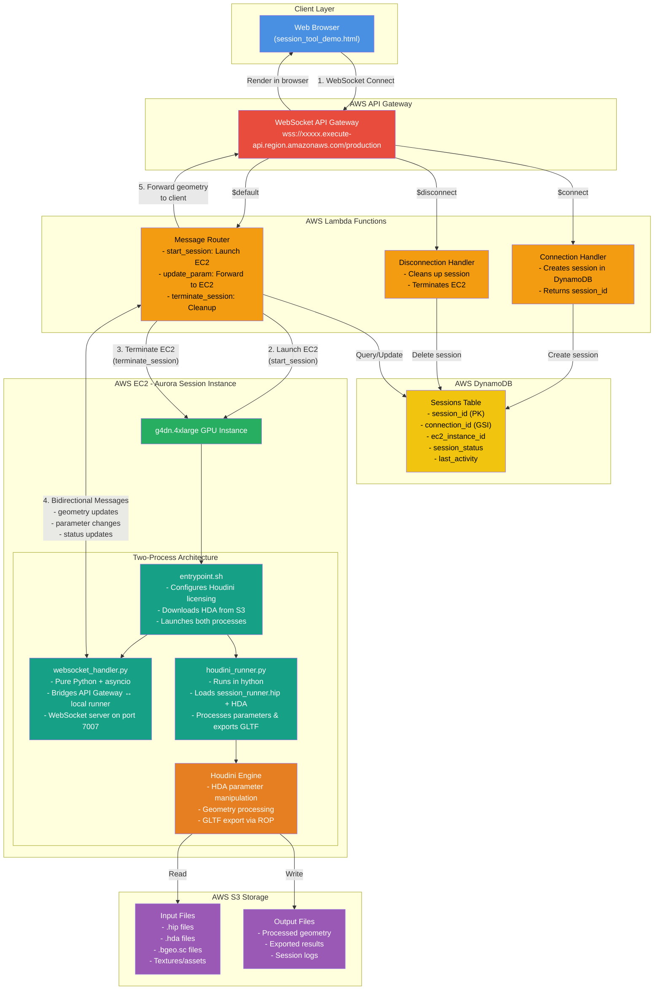

# Houdini on AWS - Aurora Session Runtime Architecture

## Runtime Flow

1. **WebSocket Connect** - Browser establishes WebSocket connection to API Gateway
2. **Launch EC2 - Lambda launches Aurora Session EC2 instance on start_session message EC2 instance on start_session message
3. **Terminate EC2** - EC2 terminates on disconnect or terminate_session message
4. **Bidirectional Messages** - Real-time communication with ~50ms latency for parameter updates and geometry streaming
5. **Forward Geometry** - Processed geometry flows back to browser for rendering

## Key Components

- **WebSocket API Gateway** - Single communication endpoint for real-time bidirectional messaging
- **Three Lambda Functions** - Handle connection lifecycle and message routing
- **DynamoDB Sessions Table** - Tracks active sessions with connection and EC2 instance mappings
- **EC2 with Houdini** - Two-process architecture: WebSocket handler + hython runner
- **S3 Storage** - Input/output file storage for HDA assets and GLTF results
